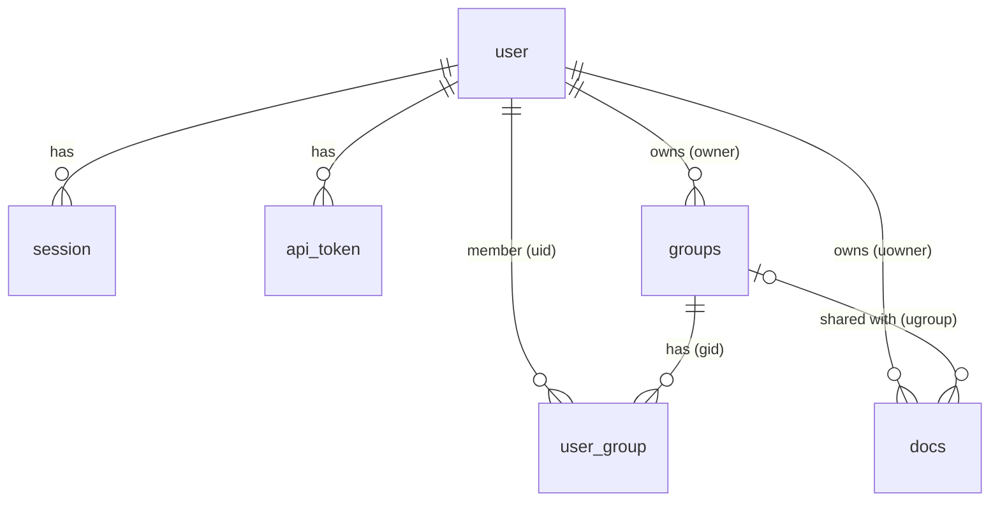

# Database schema

open-pages keeps its state in one SQLite file, `data.db`, in the data directory
(`[paths] datapath`). The driver is the pure-Go `modernc.org/sqlite`. The schema is defined
in `db.go`: a `CREATE TABLE IF NOT EXISTS` script plus idempotent migration steps, both run
on every start. Site files are not in the database; see
[getting-started.md](getting-started.md#data-directory-layout).

The database is opened with `foreign_keys` on and a 5 second `busy_timeout`. Journal mode is
SQLite's default (rollback journal); the code does not enable WAL.

## Relationships



As plain text:

```text
user 1---* session        (session.userid)
user 1---* api_token      (api_token.userid)
user 1---* groups         (groups.owner, nullable)
user 1---* docs           (docs.uowner, nullable)
user 1---* user_group *---1 groups    (user_group.uid, user_group.gid)
groups 1---* docs         (docs.ugroup, nullable)
```

"docs" is the table of sites: one row per site. `user_group` is the many-to-many link
between users and groups. No foreign key has an `ON DELETE` action, so SQLite refuses to
delete a referenced row (the default `NO ACTION`); the application deletes memberships
before groups and never deletes users.

## Tables

Declared types are SQLite type names; SQLite does not enforce the lengths in `VARCHAR(n)` or
`CHAR(n)`, so limits such as 64 or 512 are enforced by the API (in bytes or characters as
noted). Unix timestamps are integer seconds since the epoch, UTC.

### user

One row per account, local or OIDC.

| Column | Type | Constraints | Notes |
|---|---|---|---|
| `userid` | INTEGER | PRIMARY KEY | Rowid alias, auto-assigned |
| `email` | VARCHAR(255) | NOT NULL | Account name. Unique (index `user_email`) |
| `password` | BINARY(60) | NOT NULL | bcrypt hash (60 characters). Empty string `''` for OIDC accounts, which never matches a password |
| `oidc_issuer` | TEXT | NULL | Issuer URL of the identity provider; NULL for local accounts |
| `oidc_subject` | TEXT | NULL | `sub` claim at that issuer; NULL for local accounts |

Indexes:

- `user_email`: UNIQUE on `(email)`. Case-sensitive; the OIDC account creation additionally
  compares emails ignoring case.
- `user_oidc`: UNIQUE on `(oidc_issuer, oidc_subject)`. SQLite treats NULLs as distinct, so
  any number of local accounts coexist.

### session

Login sessions, one row per live cookie.

| Column | Type | Constraints | Notes |
|---|---|---|---|
| `sessionid` | INTEGER | PRIMARY KEY | |
| `userid` | INTEGER | NOT NULL, FK `user(userid)` | |
| `token` | CHAR(512) | NOT NULL, UNIQUE | 64 hex characters, the value of the `auth_cookie` cookie. Stored as is |
| `expires` | BIGINT | NOT NULL | Unix time. Set to login time plus 7 days |

Expired rows are ignored when reading and deleted whenever someone logs in.

### api_token

API tokens, hashed.

| Column | Type | Constraints | Notes |
|---|---|---|---|
| `tokenid` | INTEGER | PRIMARY KEY | The `id` in the API |
| `userid` | INTEGER | NOT NULL, FK `user(userid)` | The user the token acts as |
| `name` | VARCHAR(64) | NOT NULL | Label chosen at creation (API limit 64 bytes) |
| `prefix` | VARCHAR(16) | NOT NULL | `opt_` plus the first 8 characters of the random part, for display |
| `hash` | CHAR(64) | NOT NULL, UNIQUE | Hex SHA-256 of the full token. The token itself is never stored |
| `created` | BIGINT | NOT NULL | Unix time |
| `expires` | BIGINT | NULL | Unix time; NULL means the token never expires |

Index `api_token_user` on `(userid)`. Expired rows of a user are deleted when that user
creates a new token.

### groups

Named sets of users. The table is called `groups` (not `group`, a reserved word).

| Column | Type | Constraints | Notes |
|---|---|---|---|
| `groupid` | INTEGER | PRIMARY KEY | |
| `name` | VARCHAR(255) | NOT NULL | Display name as typed. The API limit is 64 characters |
| `owner` | INTEGER | NULL, FK `user(userid)` | Administrator of the group. NULL for groups that predate owners; such groups cannot be changed through the API |
| `name_key` | TEXT | NULL | Name after Unicode simple case folding; carries the uniqueness. Always set by the application |

Index `groups_name_key`: UNIQUE on `(name_key)`. The name column itself is not unique.

### user_group

Membership: which user is in which group.

| Column | Type | Constraints | Notes |
|---|---|---|---|
| `ugid` | INTEGER | PRIMARY KEY | |
| `uid` | INTEGER | NOT NULL, FK `user(userid)` | |
| `gid` | INTEGER | NOT NULL, FK `groups(groupid)` | |
| `oidc` | INTEGER | NOT NULL, DEFAULT 0 | 1 if the membership is managed by OIDC group mapping, 0 if added by hand. Only `oidc = 1` rows are removed by a sign-in sync |

Index `user_group_member`: UNIQUE on `(uid, gid)`. A group's owner is also a row here.

### docs

Sites. One row per site; files live on disk (see below).

| Column | Type | Constraints | Notes |
|---|---|---|---|
| `docid` | INTEGER | PRIMARY KEY | The site id |
| `uowner` | INTEGER | NULL, FK `user(userid)` | Site owner. The API always sets it; NULL means no owner (nobody can manage or, if restricted, view it) |
| `ugroup` | INTEGER | NULL, FK `groups(groupid)` | Group the site is shared with; NULL for none. Used for access only when `visibility` is `restricted` |
| `name` | VARCHAR(256) | NOT NULL, UNIQUE | Site name: a DNS label of at most 63 characters, also the directory name under `op_data/` |
| `description` | VARCHAR(512) | NULL | Free text (API limit 512 bytes) |
| `path` | VARCHAR(256) | NULL, UNIQUE | Not used by the current code; always NULL |
| `visibility` | TEXT | NOT NULL, DEFAULT `'public'`, CHECK in (`public`, `authenticated`, `restricted`) | See [auth.md](auth.md#site-visibility) |

`name` and `path` each have the automatic unique index SQLite creates for a UNIQUE
constraint (`sqlite_autoindex_docs_1`, `sqlite_autoindex_docs_2`). `session.token`,
`api_token.hash` get one the same way.

## Migrations

There is no version table and no migration files. `openDB` does this on every start, in
order:

1. Runs the `CREATE TABLE IF NOT EXISTS` / `CREATE INDEX IF NOT EXISTS` script. On a fresh
   file this creates every table with all current columns; on an existing file it leaves
   tables as they are.
2. Runs `migrate`, which brings a database created by an older release up to date, and on
   a fresh file creates the remaining unique indexes. Each step checks first, so running it
   again changes nothing:
   - adds `groups.owner` and `groups.name_key` if missing (`ALTER TABLE ... ADD COLUMN`);
   - adds `docs.visibility` if missing (existing sites become `public`);
   - adds `user.oidc_issuer`, `user.oidc_subject` and `user_group.oidc` if missing (existing
     users have NULL issuer and subject; existing memberships get `oidc = 0`);
   - fills `groups.name_key`, and resolves names that differ only in case: the group with
     the lowest id keeps its name and each later clash gets `-<id>` appended (shortened to
     fit 64 characters; if that still clashes, `_` is added until unique). Rows already
     correct are left alone;
   - deletes duplicate `user_group` rows (keeping the lowest `ugid`) and then creates the
     unique indexes `user_group_member`, `user_oidc` and `groups_name_key`, dropping an old
     `groups_name` index if present.

Operational consequences:

- Upgrading is "install the new binary and start it". Migrations run before the server
  listens, and a failure aborts startup with `migrate schema: ...`.
- **Migrations are one-way.** Back up `data.db` before upgrading (see
  [getting-started.md](getting-started.md#backups)); an older binary is not guaranteed to
  work with a database that a newer one has migrated.
- Table columns are only ever added; none is dropped or retyped (the one thing dropped is
  the obsolete `groups_name` index). The `CHECK` on `docs.visibility` is the same in a created and in a migrated table.
- To change the schema, a developer adds the table or column to the script and a guarded
  step to `migrate`; there is no separate tool.

## Data outside the database

| Where | What | Source of truth for |
|---|---|---|
| `<datapath>/data.db` | this schema | accounts, sessions, tokens, groups, site metadata |
| `<datapath>/op_data/<site>/versions/<id>/` | one extracted upload per deploy | site content |
| `<datapath>/op_data/<site>/current` | symlink to the live version | which version is served |

A site exists when it has a `docs` row; its files exist once it has been deployed. Deleting
a site removes the files first and then the row. Version ids are 20-character xids, newest
sorts last. In memory only, and lost on restart: pending OIDC sign-in attempts and the
request metrics.
